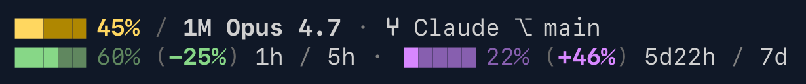
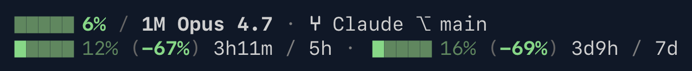
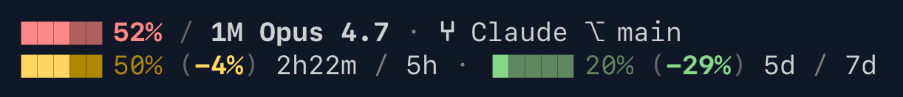
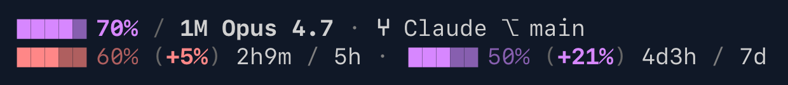

# Pacekit Statusline

A compact two-line Claude Code statusline that shows:
* Context usage
* 5-hour session usage
* 7-day limit usage 
* Active model and context window usage
* Worktree, subdirectory, and git branch

**Velocity-based pace indicators tell you whether you’re burning too fast, so you’ll know if you’re at risk of hitting usage caps.**



```
▮▮▮▮▮ 45% / 1M Opus 4.7 · ⑂ Claude ⎇ main
▮▮▮▮▮ 60% (-25%) 1h / 5h · ▮▮▮▮▮ 22% (+46%) 5d22h / 7d
```

## Anatomy

### Line 1 — context window

| Element    | Meaning                                                                            |
| ---------- | ---------------------------------------------------------------------------------- |
| `▮▮▮▮▮`    | Context fill bar (5 segments, **threshold-colored** by how full it is)             |
| `6%`       | Percent of context window used                                                     |
| `/ 1M`     | Total context window size (`1M`, `200K`, etc.)                                     |
| `Opus 4.7` | Active model                                                                       |
| `⑂ Claude` | Git worktree name (exact basename of the worktree root)                            |
| `/Subdir`  | Subdirectory within the worktree (only shown if cwd isn't the worktree root)       |
| `⎇ main`   | Current git branch (hidden when it equals the worktree name, to avoid duplication) |

### Line 2 — rate-limit windows

The 5-hour window and the 7-day window, separated by `·`:

| Element    | Meaning                                                                                                |
| ---------- | ------------------------------------------------------------------------------------------------------ |
| `▮▮▮▮▮`    | Window fill bar (5 segments, **velocity-colored** by your pace)                                        |
| `12%`      | Window usage                                                                                           |
| `(-67%)`   | **Pace** — your usage % vs. how much of the window has elapsed. Negative = under pace, positive = over |
| `3h11m`    | Time until the window resets                                                                           |
| `5h`, `7d` | Window label                                                                                           |

Rate-limit values are **Pro/Max only** — they come from fields Claude Code only sends on those plans, and only after the session's first API response. On non-Pro/Max plans, line 2 is hidden entirely and only line 1 renders.

## Colors

> **Colors represent a spectrum from good to bad.** Context coloring is a fullness threshold; rate-limit coloring is a pace ratio.

### Context bar — threshold

| Color     | Range  | Meaning                           |
| --------- | ------ | --------------------------------- |
| 🟢 Green  | < 40%  | Plenty of room                    |
| 🟡 Yellow | 40–49% | Getting full                      |
| 🔴 Red    | 50–59% | Wrap up the current thread        |
| 🟣 Violet | ≥ 60%  | Running out — compact or hand off |

### Rate-limit bars — velocity

Pace = `(usage% / elapsed%) − 1`, expressed as a percentage.

| Color | Pace | Meaning |
|---|---|---|
| 🟢 Green | ≤ -10% | Well under burn rate |
| 🟡 Yellow | -10% to 0% | Slightly under pace |
| 🔴 Red | 0% to 10% | At or over pace |
| 🟣 Violet | > 10% | Dramatically over — you'll hit the limit early |

## Examples

### Calm waters — green everywhere



```
▮▮▮▮▮ 6% / 1M Opus 4.7 · ⑂ Claude ⎇ main
▮▮▮▮▮ 12% (-67%) 3h11m / 5h · ▮▮▮▮▮ 16% (-69%) 3d9h / 7d
```

Context barely touched. Both rate-limit windows well under pace. The context bar is green because it's nearly empty; the rate-limit bars are green because Claude is burning slower than the windows are ticking down.

### Mid-session — context filling, 5h heating up



```
▮▮▮▮▮ 52% / 1M Opus 4.7 · ⑂ Claude ⎇ main
▮▮▮▮▮ 50% (-4%) 2h22m / 5h · ▮▮▮▮▮ 20% (-29%) 5d / 7d
```

Context red at 52% — into the wrap-up zone. 5h is just slightly under pace (yellow `-4%`) — half the budget spent at slightly past half-elapsed. 7d is comfortably under (green `-29%`).

### Pace and usage are independent


```
▮▮▮▮▮ 45% / 1M Opus 4.7 · ⑂ Claude ⎇ main
▮▮▮▮▮ 60% (-25%) 1h / 5h · ▮▮▮▮▮ 22% (+46%) 5d22h / 7d
```

The bar's *fill* is your usage; its *color* is your pace. They don't have to agree:

- **5h: 60% used, but green** — you've been at it for 4 hours, so even at 60% used you're well under pace. Plenty of runway in the last hour.
- **7d: 22% used, but violet** — you're only a day into the week, so even modest usage is dramatically over the long-term burn rate.

That's the whole reason for the pace number: a high-usage window can be safe and a low-usage window can be alarming. Watch the color, not just the fill.

### Warning — context near full, both windows over pace



```
▮▮▮▮▮ 70% / 1M Opus 4.7 · ⑂ Claude ⎇ main
▮▮▮▮▮ 60% (+5%) 2h9m / 5h · ▮▮▮▮▮ 50% (+21%) 4d3h / 7d
```

Context violet at 70% — running out, time to compact or hand off. 5h red — slightly over pace, you'll burn through before reset. 7d violet — dramatically over; long-term consumption is well ahead of schedule.

## Install

1. Clone the repo (or just download `statusline.sh`):

   ```bash
   git clone https://github.com/jasonesiegel/claude-code-extensions.git
   ```

2. Add to your `~/.claude/settings.json`:

   ```json
   {
     "statusLine": {
       "type": "command",
       "command": "/path/to/claude-code-extensions/pacekit-statusline/statusline.sh"
     }
   }
   ```

3. Reload Claude Code. Your statusline should appear.

## Requirements

- bash 3.2+ (macOS default works)
- jq
- git (optional — used for branch and worktree display)

## Possible future additions

Things popular statuslines include that Pacekit doesn't (yet). Open to PRs:

- **Cost / spend** — session $ or token counts
- **Session duration** — how long the current Claude Code session has been running
- **Lines added / removed** — diff stats for the session

## Credits

Built by [Jason Siegel](https://www.linkedin.com/in/jasonesiegel/).

## License

MIT — see `LICENSE`.
