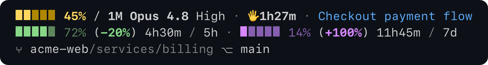
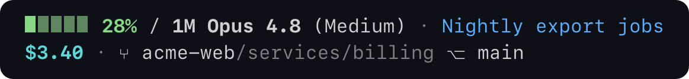
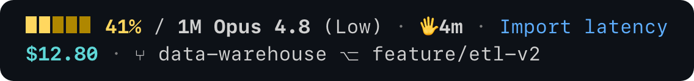
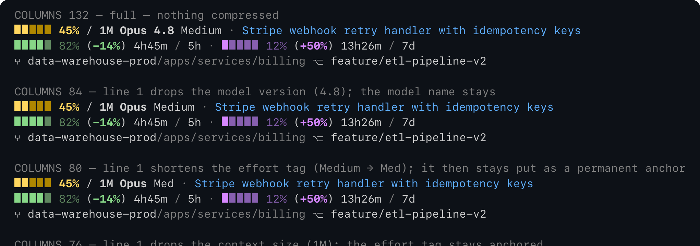
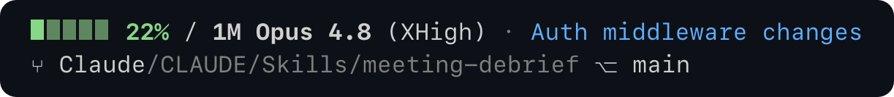

# Pacekit

**A curated Claude Code statusline that tracks your burn rate across the 5-hour and weekly
rate-limit windows — colored by whether you're ahead of or behind pace, over three lines that
compress to fit any terminal width.**



> Curated, not crammed. Pacekit picks the few signals worth your attention, surfaces each one as
> loudly as the moment demands, and stays readable at any width. Designed, not configured.

---

## What Pacekit solves

**Rate limits blindside you.**
Hit a usage limit mid-task and you're stuck until it resets. Pacekit shows both windows — your
5-hour session and 7-day week — with your pace as a color and a number: at your current rate,
whether you'll run out of quota before the window resets. If you're burning too fast, you see it
coming.

**You run several Claude sessions at once.**
Side by side, sessions blur together, and it's easy to lose track of which one is on which
worktree — or which has finished and needs you. Pacekit shows a condensed session name with its
worktree and branch, and marks any session waiting on your input with a 🖐️ and how long it's
been waiting.

**Packed status bars get hard to read.**
Cram in a dozen widgets and the line becomes a string you have to decode. Pacekit shows a focused
set of signals and uses bars and color so you read it at a glance. When your terminal is narrow it
[compresses](#responsive-layout) instead of wrapping — shedding the least-important details first.

**Your context window fills up and Claude starts forgetting.**
As context fills, Claude loses the earliest parts of the conversation. Pacekit's context bar shows
how full it is and shifts color as it climbs, so you can wrap up or compact before you lose
anything.

---

## How Pacekit compares

|                                                                  | **Pacekit** | ccstatusline |     ccusage      |
| ---------------------------------------------------------------- | :---------: | :----------: | :--------------: |
| Context-window usage                                             |    **✓**    |      ✓       |        ✓         |
| 5-hour + weekly rate-limit windows                               |    **✓**    |      ✓¹      |        ✓         |
| **Pace** — whether you'll hit a limit early at your current rate |    **✓**    |      –       |        –         |
| **Responsive** — layout adapts to your terminal width            |    **✓**    |      –       |        –         |
| Burn rate                                                        |    **✓**    |      –       |        ✓         |
| Reads Claude Code's stdin — no API calls                         |    **✓**    |  API call¹   | reads local logs |
| 🖐️ Waiting-for-you timer                                        |    **✓**    |      –       |        –         |
| Condensed session-name label                                     |    **✓**    |      –       |        –         |
| Session cost for API plans                                       |    **✓**    |      ✓       |        ✓         |

¹ ccstatusline added rate-limit display in v2.1.0 via an authenticated API call. Pacekit reads the
rate-limit data Claude Code already passes on stdin, so it makes no network calls.

**The difference is philosophy.** ccstatusline is a kit of configurable widgets — assemble what
you want. ccusage is a usage analyst — deep cost and burn-rate reporting. Pacekit decides for you:
it picks the highest-leverage signals, surfaces each as loudly as your situation demands, and lays
them out to stay legible at any width.

The craft is in the restraint — one emoji (the 🖐️ waiting marker), five-segment bars, a perceptual
(oklch) color system tuned for a dark terminal, and an element order that encodes priority so a
narrow terminal drops the least-important detail first. Every element hides cleanly when it has
nothing to show, and a window it can't measure says so (`↻`) rather than faking a number.

---

## Anatomy

On a Pro/Max plan Pacekit renders three lines: context on line 1, your rate-limit windows on line
2, git on line 3. On a pay-as-you-go API plan there are no rate-limit windows, so it's two lines:
context on line 1, cost and git on line 2.

### Line 1 — context, model, and your session

| Element                 | What it is                                                                                                         |
| ----------------------- | ------------------------------------------------------------------------------------------------------------------ |
| `▮▮▮▮▮`                 | Context fill bar — how full your context window is, colored by fullness                                            |
| `12%`                   | Share of the context window used                                                                                   |
| `/ 1M`                  | Context window size (`1M`, `200K`, …)                                                                              |
| `Opus 4.8`              | Active model                                                                                                       |
| `High`                  | Reasoning effort for the session (`Low`/`Medium`/`High`/`XHigh`/`Max`); tracks `/effort` live, hidden on models without it |
| `🖐️1h27m`              | Waiting-for-you timer — shows only while a session is awaiting your input, and counts how long it's waited         |
| `Checkout payment flow` | Your session's name (blue), condensed (hidden until Claude Code names the session; run `/rename` to set your own)  |

### Line 2 — rate-limit windows (Pro/Max)

Each window reads:

| Element | What it is |
|---|---|
| `▮▮▮▮▮` | Window fill bar, colored by your pace |
| `12%` | Share of the window used |
| `(-67%)` | Pace — at your current rate, whether you'll hit the limit before the window resets (under / over) |
| `1h41m` | How far you are into the window right now |
| `5h` · `7d` | Which window (5-hour session, 7-day week) |

The bar's **color is the pace** (the parenthetical), not the fill (the percent right after it). A
window can be nearly full and green, or nearly empty and violet — see [Colors](#colors).

On an API plan there are no windows, so line 2 carries your session cost and git instead (see
[Cost](#cost)).

### Line 3 — git

| Element | What it is |
|---|---|
| `⑂ acme-web` | Worktree (or repo) name |
| `/apps/services/billing` | Current subfolder, shown in full when it fits. As space tightens it sheds folders one level at a time, outermost first; a leading `…/` then marks the hidden ancestors (see [Responsive layout](#responsive-layout)) |
| `⎇ main` | Branch (hidden when it just duplicates the worktree name) |

Git gets its own line. Earlier versions shared it onto line 2 on the assumption that a third line
was usually hidden — but it isn't: Claude Code draws its permission-mode indicator (`▶▶ auto mode
on`, `accept edits on`, `plan mode on`) on a separate row *below* the whole statusline, so line 3
is a reliable place to live. On an API plan, where line 2 is free, git rides line 2 after the cost
and there's no line 3.

> **Seeing a fourth line?** That's Claude Code's permission-mode indicator, not Pacekit. Pacekit is
> three lines; the harness draws its mode indicator on its own row underneath, and it doesn't
> obscure line 3.

---

## Cost





On a pay-as-you-go API plan, Claude Code sends no rate-limit data, so there are no windows. Line 1
stays clean (context, model, idle hand, label) and the session cost moves to line 2 in its own
cyan, leading the git segment. With neither cost nor a repo, it collapses back to a single line.

Cost appears **only** on a pay-as-you-go API key, where it's money you're actually billed. On
Pro/Max, Claude Code still reports a cost, but it's an estimate of what your tokens *would* cost at
API rates — not a real charge — so Pacekit leaves it off rather than mislead. Even on API plans the
figure is a client-side estimate and may differ from your bill.

---

## Responsive layout

Claude Code v2.1.153+ tells the statusline how wide your terminal is (it passes `COLUMNS` and
`LINES`). On **every render**, Pacekit measures each line against that width and compresses **only
the lines that overflow, only as far as they need** — no fixed breakpoints, and nothing remembered
between renders, so the layout always reflects your current width.



Each line compresses on its own, only when it overflows, and only as far as it needs.

**Line 1** stays put on a normal-width terminal. It begins shedding only when a long session label
crowds it — when the label is taking up at least half the line. Then, to the left of the label:

| Order | What gives way | Why it's safe to drop first |
|---|---|---|
| 1 | Model **version** (`4.8`) | "Opus" still names the model; the point release is the lowest-signal adornment |
| 2 | **Effort** shortens (`Medium` → `Med`) | The effort signal stays visible, just narrower — so it outlives the bare version number |
| 3 | Context window **size** (`1M`) | Near-constant and distinctive (e.g. the 1M-context model), so it's kept until late |

The model **name** (`Opus`) and the **effort** tag are permanent anchors — the whole model block never disappears, and the effort signal is always shown (abbreviated under pressure, never dropped). Effort levels with no shorter form (`Low`, `High`, `Max`) simply stay full. Past step 3 only the `·` separators collapse; any remaining overflow clips the label's tail, which sits to the right of the effort tag.

**Line 2** (the rate-limit windows) sheds in this order:

| Order | What gives way | Why it's safe to drop first |
|---|---|---|
| 1 | Bars shrink **5 → 3** (every bar, the context bar too) | Cheap, big recovery; still readable, kept consistent across all bars |
| 2 | The window **fill %** (`82%`) | Redundant — the bar already shows the fill |
| 3 | The **5h / 7d** window totals | Pace and elapsed time still carry the meaning |

**Line 3** (git) compresses only the subfolder, never the worktree or branch, in this order:

| Order | What gives way | Result |
|---|---|---|
| 1 | Outermost folders, one level at a time | `apps/services/billing` → `…/services/billing` → `…/billing` |
| 2 | The child folder's own characters (down to a 3-letter stem) | `…/billing` → `…/bil…` — but **only** while there's a branch to keep in view |
| 3 | The whole subfolder | just the worktree and branch remain |

A leading `…/` always means "one or more ancestor folders are hidden here." The branch is the floor: the subfolder is sacrificed entirely before the branch is ever touched.

As a final squeeze, on any line that still overflows the dim `·` between segments collapses to plain
spacing.

A bar's **color** and the **pace** in parentheses never compress. Neither does the session
**label**: it's front-loaded (the distinguishing words come first), and the meta beside it sheds
first, so the terminal clips only its right edge last — and the part that tells sessions apart
survives.

Two things worth knowing:

- **Width updates aren't instant on resize.** A bare terminal resize isn't a re-render trigger;
  Pacekit re-runs after each assistant message, after `/compact`, on a permission- or vim-mode
  change, and on every [`refreshInterval`](#install) tick — so a resize is picked up on the next of
  those, and `refreshInterval` bounds the lag.
- **Older Claude Code (< v2.1.153)** doesn't pass `COLUMNS`. Pacekit detects that and prints full
  width, exactly as before — nothing breaks, you just don't get the compression.

### When a window shows `↻`

The usage number is a snapshot from your last API response; the statusline can't fetch a fresh one
on its own. If a window resets while you're idle, that snapshot no longer describes the new window
— and because limits are account-wide, a freshly-reset window's usage is genuinely unknown (another
session may have spent some), not zero. Rather than show a stale number or a misleading `0%`,
Pacekit renders a cycle glyph `↻` with a dim-green bar and fills in the real number the moment you
send your next message. The `↻` is the honest "unmeasured" marker; the green just keeps the state
from reading as a broken or blank window.



When *both* windows are in this just-reset state at once (after a long idle), two unknown windows
say nothing useful, so git takes line 2 that turn and there's no line 3 — falling back to the two
`↻` windows only when there's no repo to show.

---

## Colors

The bars run a spectrum from good to bad. Context color is a fullness threshold; rate-limit color
is a pace ratio. The session **label** sits in blue and **cost** in its own cyan — both off the
good-to-bad spectrum on purpose: a session's name and what it costs aren't good or bad, they're
information, kept in their own colors so they never read as a pace or fullness signal.

### Context bar — fullness

| Color | Range | Meaning |
|---|---|---|
| 🟢 Green | < 40% | Plenty of room |
| 🟡 Yellow | 40–49% | Getting full |
| 🔴 Red | 50–59% | Wrap up the current thread |
| 🟣 Violet | ≥ 60% | Running out — compact or hand off |

### Rate-limit bars — pace

Pace compares how much of a limit you've used to how much of the window has gone by:

```
pace = usage% ÷ elapsed% − 1
```

Spend half your 5-hour budget with half the window elapsed and you're right on pace (`0%`). Burn
faster than time passes and pace goes positive — you'll run out before the window resets. Burn
slower and it goes negative, with budget to spare.

| Color | Pace | Meaning |
|---|---|---|
| 🟢 Green | ≤ −10% | Well under your burn rate |
| 🟡 Yellow | −10% to 0% | Slightly under pace |
| 🔴 Red | 0% to 10% | At or over pace |
| 🟣 Violet | > 10% | Far over — you'll hit the limit early |

---

## Examples

### Mid-session — context filling, fill and pace disagreeing


```
▮▮▮▮▮ 52% / 1M Opus 4.8 · Merge conflicts
▮▮▮▮▮ 65% (-19%) 4h0m / 5h · ▮▮▮▮▮ 13% (+8%) 20h9m / 7d
⑂ acme-web/app/models ⎇ main
```

Context is red at 52% — into the wrap-up zone. The 5-hour window is 65% full but **green**: well
under pace four hours in. The week is only 13% full but **red** — that little, this early, is
already a touch over the long-term rate.

### A bar's color is its pace, not its fill

**A window's color comes from the number in parentheses — your pace — not the fill percentage
after the bar.** The two can read as contradictory:


```
▮▮▮▮▮ 30% / 200K Sonnet 4.6 · Analytics tables
▮▮▮▮▮ 80% (-14%) 4h36m / 5h · ▮▮▮▮▮ 16% (+100%) 13h26m / 7d
⑂ data-platform/dbt/models ⎇ main
```

- **5h: 80% full, but GREEN** — you've spent most of the 5-hour budget, yet you're 4h36m in and
  *still under pace* (`-14%`). A nearly-full bar that's completely fine.
- **7d: 16% full, but VIOLET** — you've barely touched the week, but only 13h in, so even that
  little is *far over* the long-term rate (`+100%`). A nearly-empty bar that's alarming.

Read the fill and these look backwards; read the color and they're exactly right. Watch the color.

### Warning — context near full, both windows over pace


```
▮▮▮▮▮ 70% / 1M Opus 4.8 · Memory leaks
▮▮▮▮▮ 11% (+10%) 30m / 5h · ▮▮▮▮▮ 14% (+100%) 11h45m / 7d
⑂ render-engine/src/core ⎇ main
```

Context is violet at 70% — time to compact or hand off. Both windows are barely used, but you're
burning so far ahead of the clock (red and violet) that you'll hit the limits early. The alarm is
the color, not the bar size.

---

## FAQ

**How do I see my Claude Code rate limit in the statusline?**
On a Pro or Max plan, line 2 shows both rate-limit windows — your 5-hour session and your 7-day
week — each with a fill bar, the percent of quota used, and how far into the window you are. No
setup beyond the install below.

**What's the difference between usage and pace (burn rate)?**
Usage is how much of the window you've spent (the percent). Pace is your burn rate against the
clock: `usage% ÷ elapsed% − 1`. A window can be nearly full yet on pace, or barely used yet far
over pace — pace is what tells you whether you'll run out early, so it's what the bar color tracks.

**Does it work on Pro, Max, and the pay-as-you-go API?**
Yes. On Pro/Max you get the rate-limit windows (no cost, since there it's only an estimate). On a
pay-as-you-go API key there are no windows, so Pacekit shows your real session cost instead.

**Does Pacekit make any API calls or need a token?**
No. It reads the data Claude Code already passes on stdin — no network calls, no API key, no
account, no config file.

**Why is a window showing `↻` instead of a percentage?**
The window reset while you were idle, so the last snapshot is stale. Because limits are
account-wide, the new window's usage is genuinely unknown rather than zero — Pacekit shows `↻`
until your next message brings a fresh number.

**What happens when my terminal is narrow?**
Pacekit measures each line against your width on every render and compresses only the lines that
overflow, dropping the least-important details first (see [Responsive layout](#responsive-layout)).
A bar's color, its pace, and the part of the session name that tells sessions apart never get cut.

---

## Install

1. Clone the repo (or just download `statusline.sh`):

   ```bash
   git clone https://github.com/jasonesiegel/claude-code-extensions.git
   ```

2. Point your `~/.claude/settings.json` at it:

   ```json
   {
     "statusLine": {
       "type": "command",
       "command": "/path/to/claude-code-extensions/pacekit-statusline/statusline.sh"
     }
   }
   ```

3. Reload Claude Code. Your statusline should appear.

No API keys, no account, no config file — Pacekit reads what Claude Code already provides.

**Tip:** the statusline re-renders on events. To keep the elapsed-into-window clocks and the 🖐️
timer ticking while you're idle — and to pick up a terminal resize promptly — add a
`refreshInterval` (seconds):

```json
{
  "statusLine": {
    "type": "command",
    "command": "/path/to/pacekit-statusline/statusline.sh",
    "refreshInterval": 30
  }
}
```

## Requirements

- bash 3.2+ (macOS default works)
- jq
- git (optional — used for branch and worktree display)
- Claude Code v2.1.153+ for width-responsive compression (older versions render full width)

## Credits

Built by [Jason Siegel](https://www.linkedin.com/in/jasonesiegel/).

## License

MIT — see `LICENSE`.
